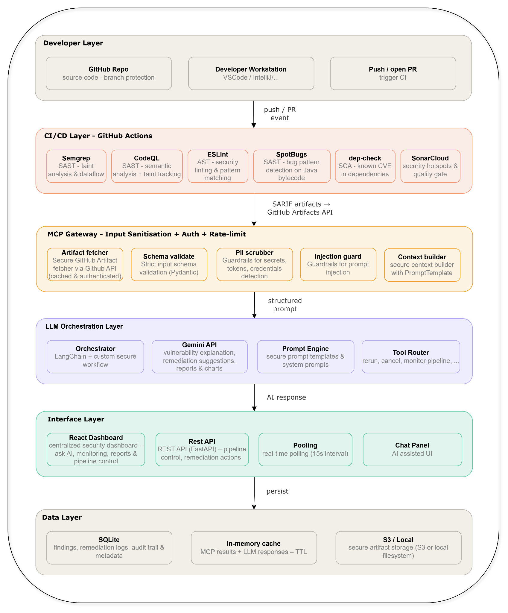
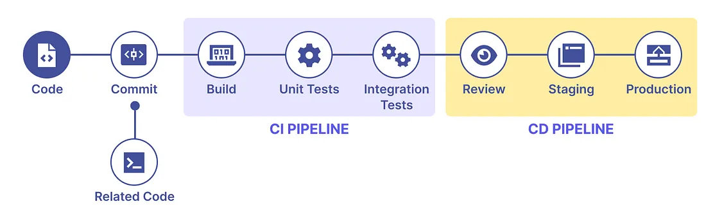
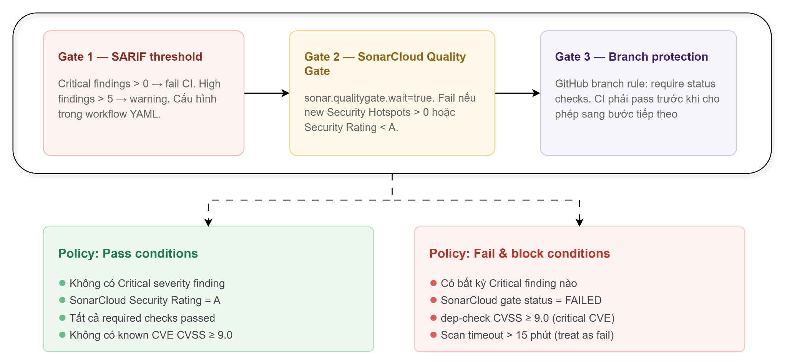

# Security-Integrated CI/CD System

> **Đồ án tốt nghiệp** — Hệ thống DevSecOps tích hợp bảo mật vào quy trình CI/CD, hỗ trợ phân tích lỗ hổng tự động bằng AI (Google Gemini) và giao diện ChatOps cho developer.

---

## Mục lục

- [Tổng quan](#tổng-quan)
- [Kiến trúc hệ thống](#kiến-trúc-hệ-thống)
- [Tính năng](#tính-năng)
- [Tech Stack](#tech-stack)
- [Cài đặt & Chạy thử](#cài-đặt--chạy-thử)
- [Biến môi trường](#biến-môi-trường)
- [Chạy tests](#chạy-tests)
- [API Documentation](#api-documentation)
- [ChatOps Commands](#chatops-commands)
- [Luồng dữ liệu](#luồng-dữ-liệu)
- [Cấu trúc thư mục](#cấu-trúc-thư-mục)

---

## Tổng quan

Hệ thống áp dụng triết lý **Shift Left Security** — phát hiện lỗ hổng bảo mật càng sớm càng tốt trong vòng đời phát triển phần mềm, thay vì chờ đến giai đoạn triển khai.

Khi developer push code lên GitHub, CI/CD pipeline tự động chạy các **SAST tools** song song. Kết quả được thu thập bởi **MCP Gateway**, chuẩn hóa về một định dạng thống nhất, làm giàu dữ liệu (CWE/CVSS/OWASP), rồi gửi cho **Google Gemini** để phân tích và đề xuất cách khắc phục bằng tiếng Việt. Toàn bộ thông tin được hiển thị trên **Web Dashboard** với khả năng tương tác qua **ChatOps slash commands**.

### Screenshots

| Dashboard Overview | Vulnerabilities | AI Chat |
|---|---|---|
|  |  |  |

---

## Kiến trúc hệ thống

```
┌─────────────────────────────────────────────────────────────┐
│                     Developer Workflow                       │
└──────────────────────────┬──────────────────────────────────┘
                           │ git push
                           ▼
┌─────────────────────────────────────────────────────────────┐
│             GitHub Actions CI/CD Pipeline                    │
│  ┌─────────┐ ┌────────┐ ┌────────┐ ┌──────────┐ ┌───────┐ │
│  │ Semgrep │ │ CodeQL │ │ ESLint │ │SpotBugs  │ │ Trivy │ │
│  └─────────┘ └────────┘ └────────┘ └──────────┘ └───────┘ │
│                   ┌──────────────────┐                      │
│                   │ OWASP Dep-Check  │                      │
│                   └────────┬─────────┘                      │
│             Artifacts (SARIF / XML / JSON)                  │
└──────────────────────────┬──────────────────────────────────┘
                           │ poll / webhook
                           ▼
┌─────────────────────────────────────────────────────────────┐
│                   MCP Gateway (FastAPI)                      │
│                                                             │
│  GitHub Poller → Normalizer → Enricher → SQLite DB          │
│                      │                                      │
│                 Guardrails                                  │
│          (PII Scrub + Injection Prevention)                 │
│                      │                                      │
│                      ▼                                      │
│            LLM Orchestrator (Gemini)                        │
│         Vietnamese analysis + remediation diff              │
└──────────────────────────┬──────────────────────────────────┘
                           │ REST API + JWT
                           ▼
┌─────────────────────────────────────────────────────────────┐
│                 Web Dashboard (React)                        │
│                                                             │
│  Overview │ Vulnerabilities │ Pipelines │ Chat │ Reports    │
│                                                             │
│       Developer / Security Lead / Admin                     │
└─────────────────────────────────────────────────────────────┘
```

---

## Tính năng

### Phát hiện lỗ hổng
- **SAST tools** chạy song song: Semgrep, CodeQL, ESLint-SARIF, SpotBugs, OWASP Dependency-Check, Trivy (cả filesystem scan + container image scan)
- **Security Gate** tự động block CI khi vượt ngưỡng finding nghiêm trọng
- **Deduplication** bằng SHA-256(rule_id + file_path + message) — không lưu trùng lặp
- **Data enrichment**: CWE ID, CVSS score, OWASP Top 10 2021 mapping
- **Lenient SARIF parser**: walks JSON dict thay vì pydantic strict, chấp nhận mọi biến thể SARIF 2.1.x từ CodeQL/Semgrep/SpotBugs/ESLint/Trivy. Mỗi file được isolate — 1 file lỗi không kill cả batch.
- **Artifact prefix matching**: bắt được `trivy-image-scan-<run_number>` (Trivy quét container) bên cạnh các tên cố định như `semgrep-report`, `codeql-report`, ...
- **Run-scoped findings**: artifact lưu kèm `github_run_id` → board tổng hợp riêng cho từng workflow run thay vì hiển thị tất cả lẫn lộn

### AI Analysis (Google Gemini)
- Phân tích lỗ hổng với output tiếng Việt — 7 trường structured JSON
- Nội dung: giải thích, tác động, `remediation_diff` (Unified Diff format), severity, CWE reference, confidence
- **Guardrails** bảo vệ trước khi gọi AI: scrub PII/email/IP, phát hiện secrets, chặn prompt injection
- Exponential backoff retry trên lỗi 429/503

### Human-in-the-Loop & Audit Trail
- Không auto-remediate — mọi finding cần **approve thủ công**
- **Role-based access**: `developer` → `security_lead` → `admin`
- Audit trail đầy đủ: ai approve/revoke, lúc nào, lý do gì (tối thiểu 20 ký tự)
- Business rules: không approve finding đã APPROVED, không revoke finding đã REVOKED

### ChatOps Interface
- Giao diện chat tích hợp trong Dashboard — không cần Slack/Teams
- **7 slash commands** tương tác trực tiếp với hệ thống
- **Natural-language chat**: gõ tự do bằng tiếng Việt — backend gọi Gemini và trả lời, đồng thời gợi ý slash command tương ứng (ví dụ "phân tích finding 5" → suggest `/explain 5`)
- Dialog xác nhận cho `/approve` và `/revoke` với validate client-side
- Toast notifications cho mọi event: command success/error, finding mới

### Web Dashboard
- **Overview**: KPI cards, severity distribution, pipeline heatmap, top rules
- **Vulnerabilities**: split-pane list + detail layout, lọc theo severity / tool / status, AI analysis panel, diff viewer, audit trail
- **Pipelines**: list workflow runs với KPI cards (passed/failed/running). Click vào 1 run → boards riêng cho run đó: severity summary, tool breakdown bar chart, top 10 findings, danh sách artifacts. Có nút **Reprocess** để xoá data cũ và xử lý lại run.
- **Reports**: export báo cáo HTML download

---

## Tech Stack

| Layer | Công nghệ |
|-------|-----------|
| **Backend** | Python 3.13, FastAPI, SQLAlchemy 2.0 async, aiosqlite |
| **Frontend** | React 19, TypeScript 6, Vite 8, Sonner |
| **Database** | SQLite (async via aiosqlite) |
| **AI** | Google Gemini (`google-genai` SDK, structured output) |
| **Auth** | JWT (`python-jose`), RBAC 3 roles |
| **SAST Tools** | Semgrep, CodeQL, ESLint, SpotBugs, OWASP Dep-Check, Trivy |
| **CI/CD** | GitHub Actions |
| **Testing** | pytest + pytest-asyncio (162 tests), Playwright E2E |

---

## Cài đặt & Chạy thử

### Yêu cầu

- Python 3.13+
- Node.js 20+
- GitHub Personal Access Token (scope: `repo`, `workflow`)
- Google Gemini API Key

### MCP Gateway (Backend)

```bash
cd mcp

# Tạo virtual environment
python -m venv .venv
.venv\Scripts\activate        # Windows
# source .venv/bin/activate   # Linux/macOS

# Cài dependencies
pip install -r requirements.txt

# Cấu hình môi trường
cp .env.example .env          # điền GITHUB_TOKEN và GEMINI_API_KEY

# Chạy server
uvicorn src.main:app --reload --port 8000
```

Server khởi động tại `http://localhost:8000`. SQLite database tự tạo tại `mcp/mcp.db`.  
Swagger UI: `http://localhost:8000/docs`

### Web Dashboard (Frontend)

```bash
cd dashboard
npm install
npm run dev
```

Dashboard chạy tại `http://localhost:5173`.

---

## Biến môi trường

Tạo file `.env` trong `mcp/`:

| Biến | Mô tả | Bắt buộc |
|------|--------|----------|
| `DATABASE_URL` | SQLite path (default: `sqlite+aiosqlite:///./mcp.db`) | — |
| `GITHUB_TOKEN` | GitHub PAT (scope: `repo`, `workflow`) | ✅ |
| `GITHUB_OWNER` | GitHub username/org | ✅ |
| `GITHUB_REPO` | Tên repo chứa CI pipeline | ✅ |
| `GEMINI_API_KEY` | Google AI API key | ✅ |
| `GEMINI_MODEL` | Model name (default: `gemini-2.5-flash`) | — |
| `SECRET_KEY` | JWT signing key (min 32 chars) | ✅ |
| `ACCESS_TOKEN_EXPIRE_MINUTES` | JWT TTL (default: 480 phút) | — |
| `CI_API_KEY` | API key cho CI → MCP webhook | — |
| `CI_WEBHOOK_TOKEN` | Token xác thực webhook từ GitHub Actions | — |
| `POLLING_WORKFLOW_NAME` | Tên workflow cần poll (default: `CI Workflow`) | — |
| `POLLING_INTERVAL_SECONDS` | Tần suất poll (default: 300s) | — |
| `APP_ENV` | `development` / `production` / `testing` | — |

```bash
# Tạo SECRET_KEY ngẫu nhiên
python -c "import secrets; print(secrets.token_hex(32))"
```

---

## Chạy tests

### Backend (pytest) — 162 tests

```bash
cd mcp

# Toàn bộ test suite (~3 giây)
pytest tests/ -q

# Chạy riêng từng module
pytest tests/test_normalizer.py -v
pytest tests/test_enricher.py -v
pytest tests/test_guardrails_scrubbing.py -v
pytest tests/test_chat_api.py -v

# Coverage report
pytest tests/ --cov=src --cov-report=html
```

### E2E (Playwright)

```bash
cd dashboard

# Headless
npm run test:e2e

# Interactive UI mode
npm run test:e2e:ui
```

> **Note:** E2E tests chạy backend ở `TEST_MODE=1` — SQLite in-memory, bypass Gemini/GitHub API, expose `/test/reset` và `/test/inject-finding` endpoints (chỉ active trong test mode).

---

## API Documentation

Swagger UI: `http://localhost:8000/docs`

### Endpoints chính

| Method | Endpoint | Mô tả | Auth |
|--------|----------|--------|------|
| `GET` | `/health` | Health check | — |
| `GET` | `/findings` | Danh sách findings (filter: severity, status) | — |
| `GET` | `/findings/{id}` | Chi tiết finding | — |
| `POST` | `/findings/{id}/explain` | Trigger Gemini analysis | — |
| `GET` | `/projects` | Danh sách projects | — |
| `POST` | `/projects` | Tạo project mới | — |
| `POST` | `/artifacts/process` | CI pipeline gửi artifact | API Key |
| `POST` | `/webhook/pipeline-complete` | CI thông báo job xong | Webhook Token |
| `GET` | `/github/runs` | GitHub workflow runs | — |
| `GET` | `/github/runs/{id}/artifacts` | Artifacts của một run | — |
| `GET` | `/github/runs/{id}/findings` | Findings đã normalize cho 1 run | — |
| `POST` | `/github/runs/{id}/reprocess` | Xoá findings cũ và xử lý lại run | — |
| `POST` | `/api/chat/auth/token` | Demo login → JWT | — |
| `POST` | `/api/chat/command` | Thực thi ChatOps command | JWT |
| `POST` | `/api/chat/message` | Free-form chat (Gemini) — trả lời + gợi ý command | JWT |
| `GET` | `/api/chat/report` | Tải báo cáo HTML | JWT |

---

## ChatOps Commands

Truy cập tab **Chat** trong Dashboard → đăng nhập chọn role → gõ lệnh:

| Command | Mô tả | Role yêu cầu |
|---------|--------|-------------|
| `/explain <id>` | Phân tích chi tiết lỗ hổng bằng AI (tiếng Việt) | developer+ |
| `/fix <id>` | Lấy remediation diff từ AI | developer+ |
| `/report` | Tạo và tải báo cáo HTML | developer+ |
| `/approve <id>` | Phê duyệt finding (mở dialog nhập lý do ≥ 20 ký tự) | security_lead+ |
| `/revoke <id>` | Thu hồi phê duyệt (mở dialog nhập lý do ≥ 20 ký tự) | security_lead+ |
| `/scan` | Kích hoạt security scan thủ công trên GitHub Actions | security_lead+ |
| `/rerun <run_id>` | Re-run CI workflow | security_lead+ |

**Ví dụ:**
```
/explain 42
/fix 42
/approve 42
  → Mở dialog → nhập: "Đã kiểm tra và xác nhận không ảnh hưởng đến production environment"
/revoke 42
  → Mở dialog → nhập: "Phát hiện lỗ hổng vẫn còn trong branch hotfix, cần kiểm tra lại"
```

### Natural-language chat

Chat tự do bằng tiếng Việt — backend gọi Gemini với context của các finding gần nhất:

```
"Hệ thống này có lỗ hổng nào nghiêm trọng không?"
"Phân tích giúp tôi finding số 5"   → AI trả lời + gợi ý chạy /explain 5
"Tôi muốn duyệt finding 8"          → AI trả lời + gợi ý chạy /approve 8
"Làm sao để xuất báo cáo?"          → AI trả lời + gợi ý chạy /report
```

Khi backend phát hiện ý định mapping được sang slash command, nó trả về kèm `suggested_command` — UI render thành chip clickable để chạy lệnh chỉ bằng 1 cú click.

---

## Luồng dữ liệu

```
1. Developer push code → GitHub Actions CI trigger
         │
         ▼
2. SAST tools chạy song song → upload artifacts (SARIF/XML/JSON)
         │
         ▼
3. MCP Poller (mỗi 5 phút) hoặc Webhook pull artifacts
   → Download + unzip (Zip Slip + Zip Bomb protection)
         │
         ▼
4. Normalizer
   → Parse SARIF / SpotBugs XML / DepCheck JSON / Trivy JSON
   → Map về FindingCreate schema thống nhất
   → SHA-256 dedup
         │
         ▼
5. Enricher → CWE description, CVSS score, OWASP Top 10 mapping
         │
         ▼
6. Store vào SQLite (status: pending_review)
         │
         ▼
7. Developer /explain <id> trong Chat
   → Guardrails: scrub PII/secrets + chặn prompt injection
   → Gemini API → structured JSON (tiếng Việt)
   → Update finding (status: ai_analyzed)
         │
         ▼
8. Security Lead /approve <id> qua ApprovalDialog
   → Validate role + justification ≥ 20 chars
   → Update finding (status: APPROVED, audit trail đầy đủ)
```

---

## Cấu trúc thư mục

```
chat-system/
├── mcp/                            # Backend — MCP Gateway Server
│   ├── src/
│   │   ├── api/
│   │   │   ├── artifacts.py        # /artifacts, /findings, /github, /webhook
│   │   │   ├── analysis.py         # /findings/{id}/explain
│   │   │   └── chat.py             # /api/chat/command, /report, /auth/token
│   │   ├── core/
│   │   │   ├── auth.py             # JWT (get_current_user, create_access_token)
│   │   │   ├── config.py           # Pydantic Settings
│   │   │   ├── db.py               # SQLAlchemy async engine
│   │   │   └── guardrails.py       # PII scrub + injection prevention
│   │   ├── models/
│   │   │   ├── entities.py         # ORM: Project, Artifact, Finding (+ audit fields)
│   │   │   └── schemas.py          # Pydantic: FindingOut, CommandRequest, ...
│   │   └── services/
│   │       ├── llm/                # Gemini client, prompt builder, response schema
│   │       ├── normalizer.py       # SARIF/XML/JSON → FindingCreate
│   │       ├── enricher.py         # CWE/CVSS/OWASP enrichment
│   │       ├── processor.py        # End-to-end artifact pipeline
│   │       ├── poller.py           # GitHub artifacts background polling
│   │       ├── github_client.py    # GitHub API (runs, artifacts, dispatch, rerun)
│   │       ├── command_service.py  # 7 ChatOps command handlers
│   │       └── report_service.py   # HTML report generator
│   ├── tests/                      # 162 unit & integration tests
│   ├── requirements.txt
│   └── .env
│
├── dashboard/                      # Frontend — React Web Dashboard
│   ├── src/
│   │   ├── api/client.ts           # Typed API client với JWT auth
│   │   ├── components/
│   │   │   ├── Shell.tsx           # Sidebar + Topbar layout
│   │   │   ├── Charts.tsx          # SVG charts (Sparkline, Donut, Heatmap, AreaTrend)
│   │   │   ├── Icon.tsx            # Inline SVG icon library
│   │   │   └── modals/             # ApprovalDialog, RevokeDialog
│   │   ├── pages/
│   │   │   ├── Overview.tsx        # KPI cards + charts tổng quan
│   │   │   ├── Vulns.tsx           # Findings browser + AI panel
│   │   │   ├── Pipelines.tsx       # GitHub runs + artifacts
│   │   │   ├── Chat.tsx            # AI Assistant với slash commands
│   │   │   ├── Reports.tsx
│   │   │   └── Settings.tsx
│   │   ├── types/index.ts          # TypeScript interfaces
│   │   ├── utils/toast.ts          # Sonner toast helpers
│   │   └── tokens.css              # Design system CSS variables
│   ├── tests/e2e/                  # Playwright E2E tests
│   │   ├── chatops.spec.ts
│   │   ├── approval.spec.ts
│   │   ├── report.spec.ts
│   │   └── polling.spec.ts
│   ├── playwright.config.ts
│   └── package.json
│
├── .planning/                      # Planning documents (phases 1–6)
├── images/                         # Screenshots
└── README.md
```

---

## Tác giả

Lê Bá Tiến Thành — Đồ án tốt nghiệp 2025
